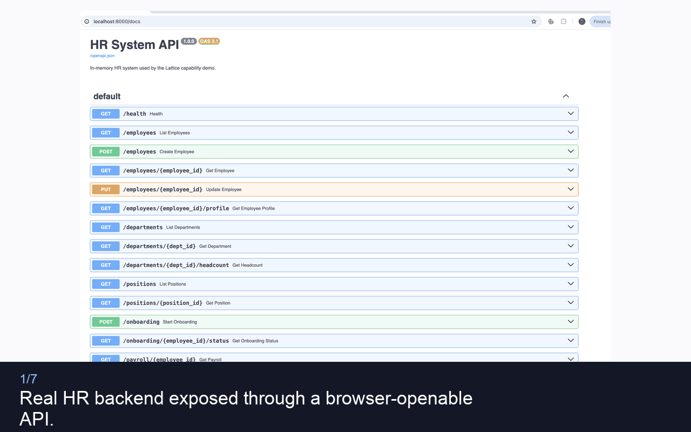

# Lattice

[](https://github.com/csehammad/Lattice/actions/workflows/ci.yml)
[](https://codecov.io/gh/csehammad/Lattice)
[](https://pypi.org/project/lattice-runtime/)
[](https://pypi.org/project/lattice-runtime/)
[](https://opensource.org/licenses/Apache-2.0)
[](https://github.com/astral-sh/ruff)

The capability runtime for outcome-based execution.
Enables AI agents to take structured, auditable actions.

Models should request outcomes, not call raw tools directly. Lattice handles sequencing, state, permissions, failure policy, and audit, then returns a projection the model can reason over.

This work builds on [Covenant Layer](https://github.com/csehammad/covenant-layer), an open protocol for outcome-based coordination across trust boundaries. Lattice focuses on execution inside one system. Covenant Layer focuses on coordination across systems.

---

## The problem

Many AI agent systems assign runtime work to the model.

The model picks tools from a long list, orders calls, rebuilds parameters from prior results, keeps intermediate state in context, handles errors ad hoc, and carries data between systems through context. In practice, it becomes orchestrator, executor, state container, error handler, and transport layer.

Language models are useful for intent understanding and explanation. They are not reliable workflow engines.

### What goes wrong in practice

**Tool explosion.** Teams expose every internal endpoint as a separate tool. The model sees many near-duplicate options: `getUser`, `getUserById`, `fetchUser`, `lookupUser`, `searchUsers`. Selection becomes pattern matching on phrasing, not dependable execution logic. That causes real incidents: duplicate non-idempotent calls, wrong system-of-record queries, or workflows triggered without expected approval. Ordering errors are also costly — booking a hotel before confirming a flight, or charging payment before confirming inventory. These are not authorization failures. The agent had permission. It sequenced wrong.

**The god-tool.** Some teams recognize tool explosion and swing to the opposite extreme — a single `do_workflow()` endpoint that hides all internals. The model receives generic failures like `{"status": "failed"}`. It cannot offer useful alternatives or clear recovery options. The agent becomes a dumb dispatcher.

**Tools that secretly become agents.** Other teams try to fix tool explosion by making individual tools smarter — a "tool" that internally calls other tools, runs its own reasoning loop, decides what to do next, and returns a synthesized answer. From the outside it looks like a clean tool call. Internally it is a hidden sub-agent with its own planning, its own branching logic, and its own downstream side effects. Identical inputs produce different execution paths. The outer system cannot trace what happened inside. Security boundaries blur because hidden prompts, hidden context, and hidden decisions expand the attack surface without anyone modeling it explicitly. If the architecture is multi-agent, it should say so and be governed as such — not smuggled into individual tool implementations.

**Context as infrastructure.** Every tool definition and every intermediate result is loaded into the model's context. A five-step workflow consumes thousands of tokens on results the user never sees. Sensitive data — patient records, financial details, employee information — sits in context not because the model needs it for reasoning, but because the next tool call will need it as input. The context window becomes a data bus.

**Invisible execution.** There is no structured record of why the model called the tools it did, in what order, with what parameters. No plan-level permissions. No way to review what the model will do before it does it. The only audit trail is the raw conversation log.

**Raw backends are the wrong interface for agents.** Internal APIs return data shaped for engineering systems, not for reasoning or user-facing decisions. They expose cryptic status codes, internal IDs, noisy payloads, and implementation details, while hiding the one thing the agent actually needs: what happened, why it matters, and what can be done next.

When a flight booking fails, the backend returns `{"status": 409, "code": "INV_001", "gds_error": "UC/NN1"}`. The model does not know what `UC/NN1` means. It can only say "something went wrong." When a policy check fails, the backend returns `{"status": 403, "policy_codes": ["TPL-0042", "BUD-0017"], "approver_dn": "CN=Sarah Chen,OU=Finance,DC=corp,DC=com"}`. The model sees "forbidden" and two codes it cannot interpret.

These are valid integration outputs. They are weak decision surfaces for model-user interaction. The gap appears in most agent stacks: backends expose implementation internals, while the model needs outcome meaning, plain reasons, and actionable options. That forces the model to guess, translate, and reconstruct meaning from low-level outputs, which makes execution brittle, explanations weak, and recovery unreliable.

---

## What Lattice does

Lattice shifts the execution boundary.

Instead of model-driven step-by-step tool orchestration, the model submits a typed intent. The runtime executes the workflow and returns a compact projection designed for reasoning.

What changes:

**Outcome-shaped contracts instead of endpoint-shaped tools.** The model sees `VendorOnboarding(vendor_name, region)` — not `checkSanctions`, `verifyInsurance`, `createVendorRecord`, `setPaymentTerms`. One capability, not four tools. The model picks an outcome, not a sequence of operations.

**Intermediate state stays in the runtime.** The sanctions check result, the insurance verification, the vendor record — all stay in runtime state. The model gets a projection: `{vendor_id, status, compliance, risk_score}`. No raw data, no intermediate payloads, no sensitive information in context.

**Permissions and failure behavior are declared in code and enforced by runtime.** Each step has a credential scope, a retry policy, and a failure mode. The model never decides whether to retry, never constructs auth headers, never reasons about error recovery.

**Each execution produces structured, queryable audit records.** Who requested it, what authority was used, what each step accessed, what failed, what the result was. Not buried in a conversation log.

```text
Without Lattice:
  model -> tool -> result in context -> model -> tool -> result in context -> model

With Lattice:
  model -> intent -> runtime executes capability -> projection -> model
```

---

## What it looks like

### The model sees capability signatures

```text
# Tool-calling surface (grows with internals):
checkSanctions(entity, country) -> SanctionsResult
verifyInsurance(vendorId) -> InsuranceStatus
createVendorRecord(details) -> VendorId
setPaymentTerms(vendorId, terms) -> Confirmation
getBudget(dept, year) -> BudgetInfo
submitApproval(requestId, approverId) -> ApprovalStatus
... 20 more tools

# Lattice surface (stable outcome contracts):
VendorOnboarding(vendor_name, vendor_type, region)
  -> { vendor_id, status, compliance, risk_score, documents_pending }

EquipmentProcurement(item, quantity, budget, vendor, needed_by)
  -> { order_status, total_cost, delivery_status, approval_status }
```

Adding a new step inside a capability does not change the signature, does not add a tool definition, does not require the model to learn anything new.

### The model gets two tools, not N

In production registries with dozens or hundreds of capabilities, listing every capability as a separate tool creates the same explosion Lattice was built to prevent. Instead, the model sees exactly **two meta-tools** regardless of registry size:

```text
# What the model sees (constant — does not grow with the registry):
search_capabilities(query)     -> matching capability signatures
execute_capability(name, inputs) -> projection

# What happens under the hood:
1. Model calls search_capabilities("vendor onboarding supplier")
2. Lattice searches the manifest (metadata only, no imports)
3. Returns: VendorOnboarding — inputs, projection schema, examples
4. Model calls execute_capability("VendorOnboarding", {vendor_name: "Acme Corp", ...})
5. Lattice lazy-loads the module, runs all steps, returns the projection
6. Model explains the result to the user
```

Capabilities are loaded on-demand from a JSON manifest. At startup, the registry holds metadata only — no Python imports, no code execution. The first call to `execute_capability` for a given name triggers the import. Subsequent calls use the cached module.

### Capabilities are executable code

Lattice does not require a new DSL or YAML contract language. A capability is normal executable code.

```python
from lattice import capability, step, state, projection
from lattice.failure import retry, soft_failure, hard_failure, abort
from lattice.auth import require_scope, require_role

@capability(
    name="VendorOnboarding",
    version="1.0",
    inputs={"vendor_name": str, "vendor_type": str, "region": str},
    projection={
        "vendor_id": {"type": str, "example": "V-12345",
                      "description": "Unique vendor identifier from ERP"},
        "status": {"type": str, "example": "active",
                   "description": "Current vendor lifecycle status"},
        "compliance": {"type": str, "example": "passed",
                       "description": "Overall compliance screening result"},
        "risk_score": {"type": int, "example": 15,
                       "description": "Risk score from sanctions screening (0-100)"},
        "documents_pending": {"type": list, "example": ["W-9", "insurance_certificate"],
                              "description": "Documents the vendor still needs to submit"},
    },
)
async def vendor_onboarding(ctx):

    @step(depends_on=[], scope="compliance.read")
    @retry(max=3, backoff="exponential", on=[TimeoutError, ServerError])
    @hard_failure(on_exhausted=abort)
    async def sanctions_check():
        client = ctx.client("sanctions_screening_api")
        result = await client.check(
            entity_name=ctx.intent.vendor_name,
            country=ctx.intent.region)
        return {"passed": result.clear, "risk_score": result.score}

    @step(depends_on=[sanctions_check], scope="compliance.read")
    @retry(max=3, backoff="exponential", on=[TimeoutError, ServerError])
    @soft_failure(fallback={"verified": False, "warning": "insurance check unavailable"})
    async def insurance_verification():
        client = ctx.client("insurance_verification_api")
        result = await client.verify(entity_name=ctx.intent.vendor_name)
        return {"verified": result.valid, "expiry": result.expiry_date}

    @step(depends_on=[sanctions_check, insurance_verification], scope="vendor.write")
    @retry(max=2, on=[TimeoutError, ServerError])
    @hard_failure(on_exhausted=abort)
    async def create_vendor_record():
        erp = ctx.client("sap")
        vendor = await erp.create_vendor(
            name=ctx.intent.vendor_name,
            type=ctx.intent.vendor_type,
            region=ctx.intent.region,
            risk_score=state.sanctions_check.risk_score,
            insurance_status=state.insurance_verification)
        return {"vendor_id": vendor.id, "payment_terms": vendor.default_terms}

    @step(depends_on=[create_vendor_record])
    async def generate_onboarding_package():
        return {
            "documents_pending": ["W-9", "insurance_certificate", "bank_details"],
            "portal_link": f"https://vendors.company.com/onboard/{state.create_vendor_record.vendor_id}"
        }

    return projection(
        vendor_id=state.create_vendor_record.vendor_id,
        status="active",
        compliance="passed" if state.sanctions_check.passed else "failed",
        risk_score=state.sanctions_check.risk_score,
        documents_pending=state.generate_onboarding_package.documents_pending
    )
```

This is real Python. You can set breakpoints, unit test each step, run it in CI. The `@capability` decorator declares what the model sees. The `@step` functions declare what the runtime executes. The decorators declare dependencies, retries, auth scopes, and failure policies. The code is the capability.

### Why projection quality matters

A projection is not a return value. It is the decision surface the model reasons over and the interface through which users experience the system.

When a capability returns a projection, three things must be true:

**The model can explain what happened.** Not "error 409" but "that seat was just booked by someone else." Not "forbidden" but "this trip exceeds your department's Q1 travel budget." The model should be able to speak to the user in one sentence without translating, guessing, or inventing context.

**The model can present what comes next.** A failed step is only useful if the projection includes structured alternatives the model can offer. Not "it failed, try again" but "here are three ways forward, each with a tradeoff." The projection turns a dead end into a conversation.

**The model can act on the user's choice.** Each option in the projection maps to something actionable — another capability, a parameter change, a human approval request. The model does not need to figure out what tool to call next. The projection tells it.

```json
{
  "status": "blocked",
  "reason": "policy_violation",
  "violations": [
    {"policy": "International Travel Limit", "threshold": 1500, "current": 1850},
    {"policy": "Q1 Travel Budget", "remaining": 340, "required": 1850}
  ],
  "options": [
    {"action": "request_approval", "approver": "Sarah Chen", "estimated_wait": "4-24h"},
    {"action": "reduce_cost", "suggestions": [
      {"change": "Downgrade hotel", "saves": 400, "new_total": 1450}
    ]},
    {"action": "split_budget", "personal_portion": 510, "company_portion": 1340}
  ]
}
```


The model reads this and says: "Your trip is blocked — it's over the $1,500 travel limit and your department budget only has $340 left. I can request approval from Sarah Chen, which usually takes 4–24 hours. Or we can downgrade the hotel to save $400, which brings you under the limit. Or you can cover $510 personally and expense the rest. What works best?"

That is a useful agent. It did not decode status codes. It did not guess at policy rules. It did not hallucinate options. Every sentence came from the projection.

**The test for a good projection:** can the model explain the result, present alternatives, and act on the user's choice — without accessing any data beyond what the projection contains? If yes, the projection is well-designed. If the model needs to make additional tool calls, interpret codes, or infer meaning, the projection is leaking backend complexity.

If capability names are clean but payloads still mirror raw backend outputs, the core problem remains. The projection schema is half the value of the capability pattern.

---

## Three ways to start

Lattice meets you where you are.

### 1. You have well-described APIs

Your systems publish metadata — FHIR CapabilityStatements, OpenAPI specs, GraphQL schemas. Lattice reads what they already publish, matches against capability templates, and generates executable code.

```bash
lattice discover --source openapi --spec ./vendor-api.yaml --source openapi --spec ./compliance-api.yaml
lattice match --inventory ./lattice.inventory.yaml --domain procurement
lattice generate --capability VendorOnboarding --output ./capabilities/
```

Generated code is the same Python shown above — reviewed and edited by humans before deployment. Generation accelerates setup. It does not replace judgment. The real product is the runtime, the execution boundary, and the projection layer.

### 2. You have some APIs and some gaps

Lattice auto-generates what it can and flags the gaps. A developer fills in the missing mappings.

```python
# Auto-generated — API fully described in OpenAPI spec
@step(depends_on=[], scope="compliance.read")
@retry(max=3, backoff="exponential", on=[TimeoutError, ServerError])
async def sanctions_check():
    client = ctx.client("sanctions_screening_api")
    result = await client.check(entity_name=ctx.intent.vendor_name, country=ctx.intent.region)
    return {"passed": result.clear, "risk_score": result.score}

# Gap — no API available, marked for developer input
@step(depends_on=[sanctions_check], scope="compliance.read")
@needs_human_input(fields=["api_client", "field_mapping"])
async def insurance_verification():
    # TODO: Connect to insurance verification system
    pass
```

### 3. You have no APIs at all

This is most companies. There is a process that humans follow, documented in a wiki or someone's head.

Each step starts as a human task. The capability works from day one — slower, because humans do the work. Over time, steps get automated as APIs are built or bought.

```python
@step(depends_on=[], scope="compliance.read")
@human_task(assigned_to="compliance_team", sla="4_hours")
async def sanctions_check():
    return await ctx.request_human_input(
        task=f"Check {ctx.intent.vendor_name} against sanctions lists for {ctx.intent.region}",
        expected_output={"passed": bool, "risk_score": int}
    )
```

When the company buys a sanctions screening API later, the developer swaps the decorator and body. The capability signature does not change. The projection does not change. The model does not notice.

```
Month 1:   All steps are human tasks. Capability works. Slow but structured.
Month 6:   Sanctions + insurance automated. Other steps still human.
Month 12:  ERP integration done. One step still human (payment terms negotiation).
Ongoing:   Payment terms stays human. Not everything should be automated.
```

---

## Developer experience

```bash
lattice discover    # Read what your systems can do
lattice match       # See what capabilities are possible
lattice generate    # Produce executable code
lattice visualize   # Review dependency graph, data flow, permissions
lattice validate    # Test against real systems
lattice register    # Make it available to models
lattice run         # Test with a real intent
```

`lattice visualize` provides a review surface for the capability before it goes to production — dependency graph with steps as nodes, color-coded by status (automated, human task, gap), click-through to step detail, data flow overlay, projection schema, and permission view.

For the "no API" path, skip `discover` and `match`. Start with `generate --human-tasks`. Later, use `lattice bind` to connect individual steps to new APIs without touching the rest of the capability.

---

## Installation

### From PyPI (when published)

```bash
pip install lattice
```

### With LLM support

```bash
pip install "lattice[llm]"        # both OpenAI and Anthropic
pip install "lattice[openai]"     # OpenAI only
pip install "lattice[anthropic]"  # Anthropic only
```

### From source

```bash
git clone https://github.com/csehammad/Lattice.git
cd Lattice
pip install -e ".[llm,dev]"
```

### Standalone binary (no Python needed)

Pre-built binaries for macOS (arm64, x86_64), Linux (x86_64), and Windows (x86_64) are available on the [Releases](../../releases) page. Download, extract, and run:

```bash
# macOS / Linux
tar xzf lattice-macos-arm64.tar.gz
chmod +x lattice
./lattice --help

# Windows
Expand-Archive lattice-windows-x86_64.zip -DestinationPath .
.\lattice.exe --help
```

To build locally:

```bash
./release/build.sh            # macOS / Linux
./release/build.sh --with-llm # include LLM SDKs
```

```powershell
.\release\build.ps1            # Windows
.\release\build.ps1 -WithLLM   # include LLM SDKs
```

See [`release/README.md`](release/README.md) for full details.

---

## CLI reference

### `lattice discover`

Parse API specifications and build an operation inventory.

```bash
lattice discover --spec ./vendor-api.yaml
lattice discover --spec ./api1.yaml --spec ./api2.yaml -o inventory.yaml
```

| Flag | Required | Description |
|------|----------|-------------|
| `--spec PATH` | Yes (repeatable) | Path to an API specification file (OpenAPI YAML/JSON) |
| `--source TYPE` | No | Source type: `openapi`, `graphql`, `fhir`. Default: `openapi` |
| `--output, -o PATH` | No | Write discovered operations to a YAML file |

### `lattice match`

Send discovered operations to an LLM to propose capabilities.

```bash
lattice match --spec ./vendor-api.yaml --provider openai
lattice match --spec ./api.yaml --domain procurement --model gpt-4o
```

| Flag | Required | Description |
|------|----------|-------------|
| `--spec PATH` | Yes (repeatable) | Path to an OpenAPI spec or discovered inventory YAML |
| `--domain TEXT` | No | Filter proposed capabilities by domain |
| `--provider TEXT` | No | LLM provider: `openai` or `anthropic` |
| `--model TEXT` | No | LLM model name (defaults: `gpt-4o` / `claude-sonnet-4-20250514`) |
| `--api-key TEXT` | No | LLM API key (or use environment variable) |

### `lattice generate`

Generate executable capability code. When `--spec` is provided, the LLM generates a full capability from discovered operations.

```bash
# LLM-powered generation from an API spec
lattice generate --capability VendorOnboarding --spec ./vendor-api.yaml -o ./capabilities/

# Generate all steps as human tasks (no-API path)
lattice generate --capability VendorOnboarding --human-tasks -o ./capabilities/

# Use a specific provider and model
lattice generate --capability VendorOnboarding --spec ./api.yaml \
  --provider anthropic --model claude-sonnet-4-20250514
```

| Flag | Required | Description |
|------|----------|-------------|
| `--capability TEXT` | Yes | Capability name (PascalCase) |
| `--output, -o PATH` | No | Output directory. Default: `./capabilities/` |
| `--spec PATH` | No (repeatable) | OpenAPI spec(s) — triggers LLM-powered generation |
| `--human-tasks` | No | Generate all steps as human tasks |
| `--provider TEXT` | No | LLM provider: `openai` or `anthropic` |
| `--model TEXT` | No | LLM model name |
| `--api-key TEXT` | No | LLM API key |

### `lattice visualize`

Display the dependency graph, data flow, and permissions for a capability. Supports both terminal output and interactive HTML.

```bash
# Terminal tree output
lattice visualize --module capabilities.vendor_onboarding --capability VendorOnboarding

# Generate interactive HTML visualization
lattice visualize --module capabilities.vendor_onboarding \
  --capability VendorOnboarding --html auto

# Specify HTML output path
lattice visualize --module capabilities.vendor_onboarding \
  --capability VendorOnboarding --html ./docs/vendor_onboarding.html
```

| Flag | Required | Description |
|------|----------|-------------|
| `--module TEXT` | Yes | Python module path containing the capability |
| `--capability TEXT` | Yes | Capability name |
| `--html PATH` | No | Generate HTML visualization. Use `auto` for `<capability>.html` |

HTML output uses Bootstrap 5 and Mermaid.js for interactive flow diagrams, step detail cards, and schema tables. An `index.html` portal page is auto-generated listing all capabilities in the output directory.

### `lattice validate`

Dry-run schema validation for a capability.

```bash
lattice validate --module capabilities.vendor_onboarding --capability VendorOnboarding
```

| Flag | Required | Description |
|------|----------|-------------|
| `--module TEXT` | Yes | Python module path |
| `--capability TEXT` | Yes | Capability name |

### `lattice register`

Save a capability's signature and metadata to a registry JSON file for model consumption.

```bash
lattice register --module capabilities.vendor_onboarding \
  --capability VendorOnboarding --registry .lattice.registry.json
```

| Flag | Required | Description |
|------|----------|-------------|
| `--module TEXT` | Yes | Python module path |
| `--capability TEXT` | Yes | Capability name |
| `--registry PATH` | No | Registry file path. Default: `.lattice.registry.json` |

### `lattice run`

Execute a capability with a real intent and display the projection.

```bash
# Basic execution
lattice run --module capabilities.vendor_onboarding \
  --capability VendorOnboarding \
  --intent '{"vendor_name": "Acme Corp", "vendor_type": "supplier", "region": "US"}' \
  --scopes "compliance.read,vendor.write"

# With stub API clients for testing
lattice run --module capabilities.vendor_onboarding \
  --capability VendorOnboarding \
  --intent '{"vendor_name": "Acme Corp", "vendor_type": "supplier", "region": "US"}' \
  --scopes "compliance.read,vendor.write" \
  --stubs demo.stubs
```

| Flag | Required | Description |
|------|----------|-------------|
| `--module TEXT` | Yes | Python module path |
| `--capability TEXT` | Yes | Capability name |
| `--intent JSON` | Yes | JSON string with input fields |
| `--scopes TEXT` | No | Comma-separated scopes to grant |
| `--stubs TEXT` | No | Python module exporting `client_factory(name, credentials)` |

### `lattice bind`

Connect an individual step to a new API client without rewriting the capability.

```bash
lattice bind --module capabilities.vendor_onboarding \
  --step insurance_verification --to insurance_api
```

| Flag | Required | Description |
|------|----------|-------------|
| `--module TEXT` | Yes | Python module path |
| `--step TEXT` | Yes | Step name to bind |
| `--to TEXT` | Yes | Target API client name |

---

## Environment variables

| Variable | Purpose |
|----------|---------|
| `OPENAI_API_KEY` | API key for OpenAI (used by `match` and `generate`) |
| `ANTHROPIC_API_KEY` | API key for Anthropic |
| `LATTICE_LLM_PROVIDER` | Default LLM provider: `openai` or `anthropic` |
| `LATTICE_LLM_MODEL` | Default LLM model name |

CLI flags (`--provider`, `--model`, `--api-key`) take precedence over environment variables.

---

## Python module reference

### Core imports

```python
from lattice import capability, step, state, projection
```

| Symbol | What it does |
|--------|-------------|
| `@capability(name, version, inputs, projection)` | Declares a capability with typed inputs and a projection schema |
| `@step(depends_on, scope)` | Declares an executable step inside a capability |
| `state` | Access results from earlier steps: `state.step_name.field` |
| `projection(**kwargs)` | Build the projection dict returned to the model |

### Failure and retry

```python
from lattice.failure import retry, soft_failure, hard_failure, abort
```

| Decorator | Purpose |
|-----------|---------|
| `@retry(max=N, backoff="exponential", on=[ExceptionType])` | Retry a step up to N times |
| `@soft_failure(fallback={...})` | Provide fallback data when a step fails |
| `@hard_failure(on_exhausted=abort)` | Stop the entire capability when a step fails after retries |

Decorator order (outermost to innermost): `@step` → `@retry` → `@soft_failure` or `@hard_failure`.

### Human tasks

```python
from lattice.human import human_task, needs_human_input
```

| Decorator | Purpose |
|-----------|---------|
| `@human_task(assigned_to, sla)` | Step is performed by a human |
| `@needs_human_input(fields=[...])` | Step has gaps requiring developer input |

### Auth and scopes

```python
from lattice.auth import require_scope, require_role
```

Each `@step(scope="domain.permission")` declares what the step can access. The runtime validates all scopes before execution begins.

### Projection schema (rich format)

Projection fields support type, example, and description so the model knows what to expect before execution:

```python
@capability(
    name="VendorOnboarding",
    version="1.0",
    inputs={"vendor_name": str, "vendor_type": str, "region": str},
    projection={
        "vendor_id": {
            "type": str,
            "example": "V-12345",
            "description": "Unique vendor identifier assigned by the ERP",
        },
        "status": {
            "type": str,
            "example": "active",
            "description": "Current vendor lifecycle status",
        },
        "risk_score": {
            "type": int,
            "example": 15,
            "description": "Numeric risk score from sanctions screening (0-100)",
        },
    },
)
```

Plain types (`{"vendor_id": str}`) are still supported for backwards compatibility.

The model sees these examples in the capability signature:

```text
VendorOnboarding(vendor_name, vendor_type, region)
  -> { vendor_id: str (e.g. 'V-12345'), status: str (e.g. 'active'), risk_score: int (e.g. 15) }
```

### Runtime engine (programmatic use)

```python
import asyncio
from lattice.runtime.engine import Engine
from lattice.auth.scopes import CredentialStore

engine = Engine()
creds = CredentialStore(granted_scopes={"compliance.read", "vendor.write"})

result = asyncio.run(
    engine.execute(
        vendor_onboarding,
        {"vendor_name": "Acme Corp", "vendor_type": "supplier", "region": "US"},
        credentials=creds,
        client_factory=my_client_factory,  # optional
    )
)
```

### Registry (programmatic use)

```python
from lattice.runtime.registry import CapabilityRegistry

registry = CapabilityRegistry()
registry.register(vendor_onboarding)

# List all capability signatures
for sig in registry.signatures():
    print(sig)

# Save to JSON manifest (includes module paths for lazy loading)
registry.save(".lattice.registry.json")
```

### LazyRegistry (progressive loading)

For agent integration, use `LazyRegistry` instead of loading all capabilities upfront. It reads a JSON manifest at startup (metadata only) and imports capability modules on-demand:

```python
from lattice.runtime.registry import LazyRegistry

# Load manifest — no Python imports happen here
lazy = LazyRegistry.from_manifest(".lattice.registry.json")

# Search by keyword (fast, metadata only)
results = lazy.search("vendor onboarding")

# First execution triggers the import
lazy.ensure_loaded("VendorOnboarding")
fn = lazy.get_function("VendorOnboarding")

# Get the two meta-tool definitions for OpenAI function-calling
tools = LazyRegistry.openai_meta_tools()
# Returns: [search_capabilities, execute_capability]
```

The manifest is generated by `CapabilityRegistry.save()` or `lattice register`. It contains name, version, input schema, projection schema (with examples), module path, and function name — everything the agent needs to search and execute without importing code upfront.

### Audit trail

Every execution emits structured audit records:

```python
engine = Engine()
# ... execute ...

record = engine.audit_trail.records[-1]
print(record.execution_id)  # unique ID
print(record.status)         # completed / failed
print(record.duration_ms)    # wall-clock time
print(record.step_results)   # per-step outcomes
```

---

## Agent integration

Lattice is designed as the execution backend for LLM agents. The agent handles intent understanding; Lattice handles structured execution.

### Search-then-Execute pattern

Instead of registering every capability as a separate tool (which recreates tool explosion at the capability level), the agent exposes two meta-tools:

| Tool | Purpose |
|------|---------|
| `search_capabilities(query)` | Search the manifest by keyword. Returns matching capability names, input schemas, and projection schemas with examples. |
| `execute_capability(name, inputs)` | Lazy-load and execute a capability through the Lattice engine. Returns the projection. |

This keeps the tool surface constant regardless of registry size. The model discovers what it needs, then executes — mirroring how Lattice separates intent from execution.

### Running the agent demo

```bash
# Set your OpenAI API key
export OPENAI_API_KEY=sk-...

# Run the interactive agent
python -m demo.agent.run_agent

# Use a different model
python -m demo.agent.run_agent --model gpt-4o-mini
```

The full demo suite now lives under [`demo/`](demo/README.md):
- [`demo/procurement/`](demo/procurement/README.md)
- [`demo/travel/`](demo/travel/README.md)
- [`demo/hr/`](demo/hr/README.md)

Demo walkthrough:



Example session:

```text
You: Onboard Acme Corp as a supplier in the US

  ╭─ Lattice Execution ─╮
  │ Capability  VendorOnboarding v1.0  │
  │ Status      completed              │
  │ Steps       5                      │
  │ Loaded      on demand              │
  ╰──────────────────────╯

Agent: Acme Corp has been successfully onboarded as a supplier in the US.
       Vendor ID is V-10001, status is active. Compliance passed with a
       risk score of 15. Pending documents: W-9, insurance certificate,
       bank details.
```

The agent searched the registry, found `VendorOnboarding`, extracted inputs from the user's message, executed the capability (5 steps, real code), and summarized the projection. The model never saw raw API calls, credentials, or intermediate state.

### Building your own agent

```python
from lattice.runtime.engine import Engine
from lattice.runtime.registry import CapabilityRegistry, LazyRegistry

# 1. Register capabilities and save a manifest
registry = CapabilityRegistry()
registry.register(vendor_onboarding)
registry.register(equipment_procurement)
registry.save("registry.json")

# 2. Create a lazy registry from the manifest
lazy = LazyRegistry.from_manifest("registry.json")

# 3. Get the two meta-tools for your LLM
tools = LazyRegistry.openai_meta_tools()

# 4. When the model calls search_capabilities:
results = lazy.search("vendor onboarding")  # metadata only, no imports

# 5. When the model calls execute_capability:
lazy.ensure_loaded("VendorOnboarding")
fn = lazy.get_function("VendorOnboarding")
engine = Engine()
projection = await engine.execute(fn, inputs, credentials=creds,
                                  client_factory=my_factory)
```

See [`demo/README.md`](demo/README.md) for the full demo layout, and `demo/agent/` for the shared OpenAI function-calling implementation.

---

## How Lattice differs from existing tools

### Temporal / Step Functions

Temporal and Step Functions are workflow engines where developers define flows directly.

Lattice differs in three ways. The entry point is a typed intent from a model, not a developer-written workflow definition. The model-facing projection is a first-class part of the contract. And step-level credential scoping and failure policy are runtime primitives, not application logic.

Lattice can use Temporal or Step Functions underneath for durable execution. They are not competing at the same layer.

### LangChain / LangGraph

These frameworks wire model calls with tools and data. The model still picks tools step by step within developer-written orchestration logic.

In Lattice, the model picks outcomes. The runtime handles internal orchestration.

### Well-designed MCP servers

Good MCP servers can reduce tool chaos with better interfaces and richer responses — and that is good engineering.

Lattice adds what MCP alone does not provide: a runtime layer for consistent orchestration, scoped credential injection, runtime-managed state outside model context, declared failure policies, and structured audit trails across capability runs. Whether the underlying calls go through MCP, REST, gRPC, or direct database access, the capability contract and execution guarantees remain the same.

The tool-surface difference is also structural. MCP exposes fine-grained operations (`read_file`, `run_query`). Lattice exposes outcome-shaped capabilities. And with the search-then-execute pattern, the model sees exactly two tools regardless of how many capabilities exist — avoiding tool explosion at the capability level too.

---

## Security, identity, and audit

**The model never holds credentials.** Credentials live in the runtime. The model produces intent. The runtime injects credentials at execution time based on each step's declared scope.

**Scoped access per step.** Each step declares what it can access. A step with `compliance.read` scope cannot access vendor write operations. Enforced by the runtime, not by trusting the step implementation.

**Permissions validated before execution.** The runtime checks all permissions when the plan is compiled — before any step runs, before any API is called. If the user lacks authorization, the plan fails cleanly before anything happens.

**Structured audit trail.** Every execution produces a log: who requested it, what authority was used, what each step accessed, what failed, what the result was. Queryable and structured, not buried in conversation history.

---

## Relation to Covenant Layer

[Covenant Layer](https://github.com/csehammad/covenant-layer) and Lattice operate at different scopes.

Lattice handles execution within a trust boundary — internal APIs, internal workflows, internal approvals. Most tasks stay here.

Covenant Layer handles coordination across trust boundaries — when fulfillment depends on an external provider, when commitment terms need to be explicit, when evidence and settlement matter. A Lattice step can hand off to Covenant Layer when execution needs to cross that boundary.

Inside: Lattice with runtime-enforced permissions and audit.
Across: Covenant Layer with identity verification, stake-backed commitments, and on-chain settlement.

---

## What Lattice is not

Lattice is not a tool wrapper. It composes endpoints into outcomes.

Lattice is not a thin API wrapper with nicer names. If the projection returns the same raw payloads, the core problem remains. The projection must be designed for model reasoning.

Lattice is not a contract language or DSL. Capabilities are real, executable, testable code.

Lattice is not a general-purpose workflow engine. It is built specifically for the boundary between AI models and enterprise systems.

Lattice is not a multi-agent platform. Agents can use Lattice underneath, but Lattice does not coordinate between agents.

---

## Design principles

```text
The model produces intent, not tool-call sequences.
Capabilities are executable code.
State remains in the runtime, not model context.
Sensitive data does not cross the model boundary.
Credentials are runtime-injected.
Permissions are checked before execution.
Failure behavior is policy-driven.
Each execution emits structured audit records.
Human and automated steps can coexist in one capability.
Capabilities are discovered progressively, not loaded upfront.
Generation speeds setup; humans review and shape outcomes.
```

---

## Status

Early-stage design and specification. Current implementation work focuses on procurement and compliance workflows with mixed human and automated execution, strict audit requirements, and high sequencing risk.

---

## Further reading

- [Covenant Layer](https://github.com/csehammad/covenant-layer) — open protocol for outcome-based coordination across trust boundaries
- [What Pulling Espresso Taught Me About Building Enterprise AI Agents](https://levelup.gitconnected.com/what-pulling-espresso-taught-me-about-building-enterprise-ai-agents) — why capability design is the "grind size" that determines extraction quality in AI agent systems
- [The Future of Agents Is Outcome Coordination](https://levelup.gitconnected.com/the-future-of-agents-is-outcome-coordination-09807612ca2d) — the architectural thesis behind Covenant Layer
- [The Future of Agents Is Outcome Coordination, Part II](https://medium.com/@hammadulhaq/the-future-of-agents-is-outcome-coordination-part-ii-dc251091c294) — deeper technical treatment
